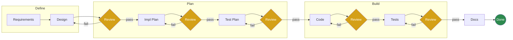
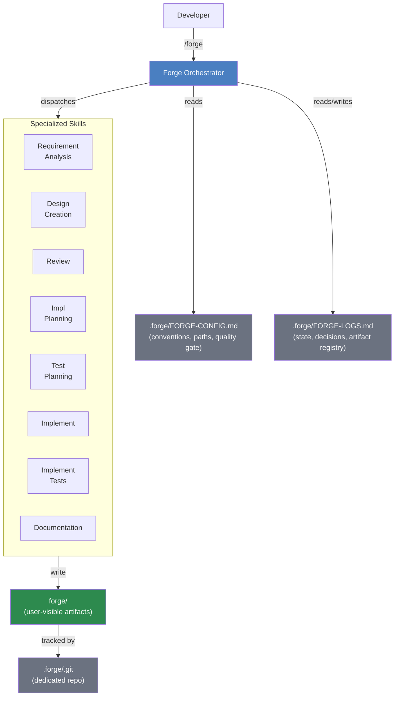
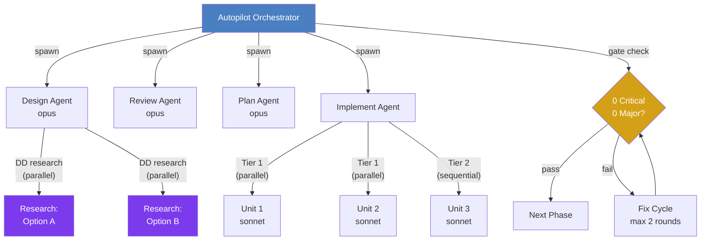

# Forge — Structured AI-Assisted Development

**A skill-based workflow system that brings engineering rigor to LLM-powered coding.**

---

## The Problem

AI coding assistants are powerful but unstructured. When developers use LLMs for feature work, common failure modes emerge:

- **Context drift** — long conversations lose focus; the AI forgets early decisions
- **Skipped reviews** — no natural checkpoint to catch design flaws before implementation
- **Implicit decisions** — architectural choices are made silently, never documented
- **Throwaway context** — knowledge generated during development dies with the chat session
- **Inconsistent quality** — output quality depends on how well the developer prompts

The result: rework, undocumented designs, and code that doesn't match requirements.

---

## The Solution

Forge is a plugin system for [Claude Code](https://docs.anthropic.com/en/docs/claude-code) (Anthropic's developer CLI) that decomposes feature development into **12 reviewable phases**, each producing a concrete artifact.

Every phase is powered by a specialized skill that knows exactly what to produce, what quality bar to hit, and where to hand off. Review gates (yellow) block progression until all critical and major findings are resolved. Developers stay in their terminal — no context switching, no new tools to learn.

---

## Key Capabilities

**Automated convention detection** — On first run, Forge scans the codebase and auto-detects language, framework, naming patterns, test setup, and quality gate commands. Developers confirm; Forge adapts.

**Persistent state across sessions** — A structured log file tracks every phase, decision, and artifact. Starting a new chat loses nothing — the AI reads the log and picks up exactly where it left off.

**Interactive design decisions** — When multiple architectural approaches exist, Forge researches each option in parallel, presents a structured comparison, and lets the developer choose. Decisions and rationale are captured permanently.

**Review gates with severity tracking** — Every artifact is reviewed before the next phase begins. Findings are ranked (Critical / Major / Minor / Suggestion) and persisted as numbered review artifacts with resolution tracking across rounds.

**Auto-parallelized implementation** — The implementation plan declares unit dependencies. Forge builds a dependency graph and automatically parallelizes independent units when running in orchestrated mode.

**Full autopilot mode** — For teams comfortable with automation, Forge can run the entire pipeline end-to-end using coordinated sub-agents, pausing only for user decisions and escalations.

---

## What Gets Produced

Each feature developed with Forge generates a complete artifact trail:

- **REQUIREMENTS.md** — Extracted specs with acceptance criteria, edge cases, constraints
- **DESIGN.md** — Technical design with contracts, wire formats, sequence diagrams, test matrix
- **Design decision research** — Per-decision analysis artifacts with options, tradeoffs, rationale
- **IMPL-PLAN.md** — Pseudocode implementation units with dependency tiers
- **TEST-PLAN.md** — Exhaustive test cases mapped to requirements and implementation units
- **Numbered review artifacts** — Persistent, auditable review history for every phase
- **CONTEXT.md** — Post-implementation summary for future developers and AI agents

All artifacts are version-tracked in a dedicated repository, separate from the codebase.

---

## Why This Matters

| Without Forge | With Forge |
|---------------|------------|
| Design decisions live in chat history | Design decisions are researched, documented, and persisted |
| Reviews happen informally or not at all | Every artifact is gated by structured review |
| New team members start from zero context | CONTEXT.md and artifact trail provide full history |
| AI output quality varies by prompt quality | Specialized skills enforce consistent output structure |
| Implementation drifts from requirements | Traceability from requirements through tests |
| Context is lost between sessions | State file enables seamless multi-session workflows |

---

## Architecture

Forge is **zero-infrastructure** — no servers, no databases, no SaaS dependencies. It runs entirely inside Claude Code using markdown skill files and the local filesystem.

### System Overview

### Orchestration Modes

Forge supports two modes of operation — same skills, same artifacts, different levels of automation.

**Manual mode** — The developer drives each phase. `/forge` shows current status and suggests the next step. The developer invokes each skill explicitly ("create design", "review", "implement"). Best for learning the workflow or when close oversight is desired.

**Autopilot mode** — A single orchestrator agent runs the full pipeline using coordinated sub-agents. Each phase is dispatched to a dedicated agent with focused context (target: <30% of context window per agent). Review gates are evaluated automatically — 0 critical + 0 major findings to pass. Failed gates trigger fix cycles (max 2 rounds before escalating to the developer). The orchestrator pauses only for user decisions: convention confirmation, design decision choices, and escalations.

### Sub-Agent Architecture

Design decisions and independent implementation units are parallelized automatically — Forge reads the dependency graph from the implementation plan and dispatches independent work to concurrent sub-agents. No developer configuration required.

### State & Configuration

**`.forge/` — Internal state** (auto-managed, not meant for manual editing)

- **FORGE-CONFIG.md** — Project conventions detected on first run: language, framework, naming patterns, test setup, mocking strategy, quality gate command. Skills read this instead of re-analyzing the codebase each time. Updated when new conventions are discovered.
- **FORGE-LOGS.md** — Append-only state file. Tracks current phase, all artifacts with paths and git SHAs, key decisions at each phase, review rounds and resolution status. This is what allows Forge to resume seamlessly across chat sessions — a new conversation reads the log and knows exactly where things stand.
- **Dedicated git repo** — Forge maintains its own git repository inside `.forge/`, separate from the project's source control. Every phase completion triggers an auto-commit. SHAs are recorded in the log, enabling rollback to any prior phase.

**`forge/` — Artifacts** (user-visible, browsable, reviewable)

All documents Forge produces live here — requirements, designs, plans, reviews, research artifacts. The directory name is configurable during setup; Forge adapts to existing project conventions (e.g., `docs/` if that's what the project already uses).
    
### Design Principles

- **Artifact-based handoffs** — Skills communicate through files, not conversation context. Each skill reads input files and writes output files. The orchestrator never reads full artifact content — only tracks paths and status.
- **Convention-first** — Forge analyzes the codebase and adapts rather than prescribing. Language-agnostic skills, pseudocode templates, discovered test patterns.
- **Pluggable** — Use individual skills standalone or the full 12-phase workflow. Works with Claude Code's existing permissions, sandboxing, and approval model.
- **Minimal context per agent** — In autopilot mode, each sub-agent gets only what it needs: task description, input file paths, output path, and config reference. Keeps context usage lean and output quality high.

---

## Example: Adding an API Rate Limiter

A developer needs to add rate limiting to an Express API. Here's what a Forge session looks like:

> **Developer:** `/forge`

Forge scans the codebase, detects Express + TypeScript + vitest, and writes a config file with detected conventions. Prompts the developer to drop context and begin.

> **Developer:** *drops a Jira ticket into `forge/context/`* — "analyze requirements"

Forge reads the ticket and asks 6 clarifying questions — per-user vs global limits? Redis or in-memory? What response headers? The developer answers from Slack and Confluence. Forge writes **REQUIREMENTS.md** with 4 functional requirements, 2 non-functional requirements, and 3 edge cases.

> **Developer:** "create design"

Forge identifies 2 design decisions with multiple viable options. It researches each option in parallel using dedicated sub-agents, writes analysis artifacts, and presents a structured comparison: *"DD-1: Redis vs in-memory? DD-2: Token bucket vs sliding window?"* The developer picks Redis + sliding window. Forge writes **DESIGN.md** with contracts, wire formats, and a test matrix.

> **Developer:** "review the design"

Forge reviews the design against requirements. Finds 1 MAJOR issue — missing 429 response shape. Developer fixes it. Re-review passes. Gate cleared.

> **Developer:** "create implementation plan"

Forge analyzes the codebase, finds existing middleware patterns, and produces **IMPL-PLAN.md**: 3 implementation units across 2 tiers, with 2 units parallelizable. *Plan review, test planning, and test plan review follow the same pattern.*

> **Developer:** "implement"

Forge translates pseudocode to production code following detected conventions. Runs Tier 1 units in parallel, then Tier 2 sequentially. Quality gate (vitest + tsc + eslint) passes.

> **Developer:** "implement tests"

Forge writes tests matching existing vitest patterns and conventions. 14 tests, 92% coverage. Quality gate passes.

> **Developer:** "document"

Forge adds docstrings, updates README, and writes **CONTEXT.md** — a summary for future developers. Feature complete. Full artifact trail preserved.

**Total output:** 7 versioned documents + review history + design research artifacts.

---

## Current Status

- Built and tested through real feature development workflows
- Language-agnostic (validated with TypeScript codebases, designed for any stack)
- Open for internal adoption and feedback

**Next steps:** Pilot with 2-3 teams, measure impact on review cycles and rework rates, iterate on skill instructions based on real usage patterns.

---

*Forge turns AI-assisted coding from an unstructured conversation into a repeatable engineering process.*
