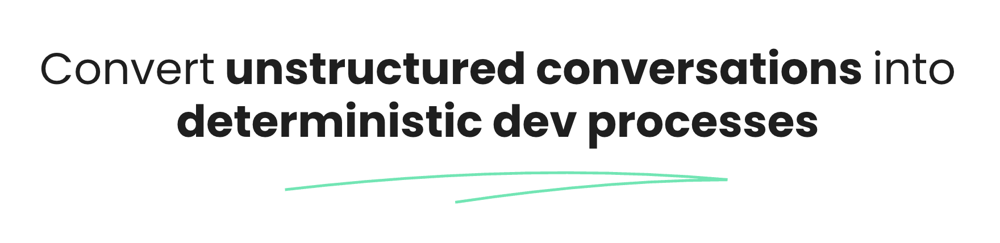
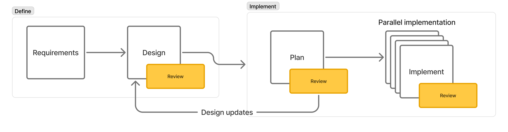
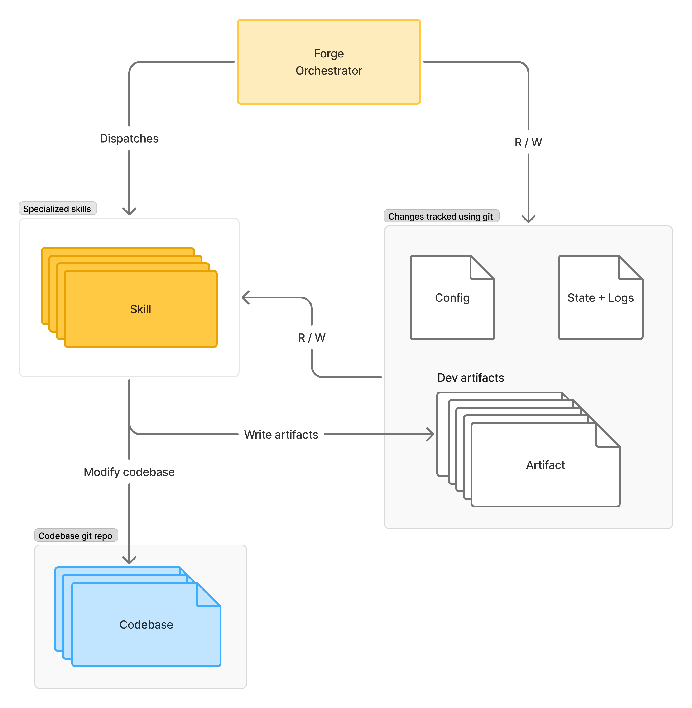

# Forge: 2x your dev productivity

`forge` is a skill that orchestrates development tasks, following principles of [spec-driven development](https://github.blog/ai-and-ml/generative-ai/spec-driven-development-with-ai-get-started-with-a-new-open-source-toolkit/).

## What it solves 👀

**Are you tired of:**

- Scattered context across files, agent-conversations, docs?
- Repeated prompting for dev-tasks in iterative cycles?
- Manual agent-conversation tracking?
- SLOW dev-workflows?

## How `forge` solves this ✨

- ONE home for all your context
- All the good parts of spec-driven-development
- Dev-tasks packaged as **Claude skills**
- `git`-tracked dev workflows (for easy rollbacks)

---

## How it works

- An SDD-inspired workflow consisting of packaged skills for:
  - Requirement analysis + refinement
  - Design creation (interactive)
  - Implementation planning
  - Parallel implementation (using Claude subagents)
  - Cascading review of changes
- Artifacts for each step, all **review-able**
  - REQUIREMENTS.md
  - DESIGN.md
  - IMPLEMENTATION-PLAN.md
  - Review / analysis artifacts

## Let's talk about results 📈

- Battle tested on **real production SDK features** — shipped multiple merged PRs in large open-source codebases, including net-new features and tech-debt cleanup.
- Language agnostic and extensible.

---

## Example: Adding an API Rate Limiter

Example (expand)

A developer needs to add rate limiting to an Express API. Here's what a Forge session looks like:

> **Developer:** `/forge`

Forge scans the codebase, detects Express + TypeScript + vitest, and writes a config file with detected conventions. Prompts the developer to drop context and begin.

> **Developer:** *drops a ticket into* `forge/context/` — "analyze requirements with forge"

Forge reads the ticket and asks 6 clarifying questions — per-user vs global limits? Redis or in-memory? What response headers? The developer answers from chat and docs. Forge writes **REQUIREMENTS.md** with 4 functional requirements, 2 non-functional requirements, and 3 edge cases.

> **Developer:** "create design with forge"

Forge identifies 2 design decisions with multiple viable options. It researches each option in parallel using dedicated sub-agents, writes analysis artifacts, and presents a structured comparison: *"DD-1: Redis vs in-memory? DD-2: Token bucket vs sliding window?"* The developer picks Redis + sliding window. Forge writes **DESIGN.md** with contracts, wire formats, and a test matrix.

> **Developer:** "review the design with forge"

Forge reviews the design against requirements. Finds 1 MAJOR issue — missing 429 response shape. Developer fixes it. Re-review passes. Gate cleared.

> **Developer:** "create implementation plan"

Forge analyzes the codebase, finds existing middleware patterns, and produces **IMPL-PLAN.md**: 3 implementation units across 2 tiers, with 2 units parallelizable. *Plan review, test planning, and test plan review follow the same pattern.*

> **Developer:** "implement with forge"

Forge translates pseudocode to production code following detected conventions. Runs Tier 1 units in parallel, then Tier 2 sequentially. Quality gate (vitest + tsc + eslint) passes.

> **Developer:** "implement tests with forge"

Forge writes tests matching existing vitest patterns and conventions. 14 tests, 92% coverage. Quality gate passes.

> **Developer:** "document with forge"

Forge adds docstrings, updates README, and writes **CONTEXT.md** — a summary for future developers. Feature complete. Full artifact trail preserved.

**Total output:** 7 versioned documents + review history + design research artifacts.

## Architecture

Zero infrastructure, Claude-Code-based state machine.

- **Specialized skills:** installed as markdown files in Claude Code's skill directory
- **Stack-agnostic**: adapts to any language, framework, or project structure
- **Artifact-based handoffs**: skills communicate through files, not conversation context
- **Pluggable**: use individual skills standalone or the full phased workflow

### Key Capabilities

Capabilities (expand)

**Automated convention detection** — On first run, Forge scans the codebase and auto-detects language, framework, naming patterns, test setup, and quality gate commands. Developers confirm; Forge adapts.

**Persistent state across sessions** — A structured log file tracks every phase, decision, and artifact. Starting a new chat loses nothing — the AI reads the log and picks up exactly where it left off.

**Interactive design decisions** — When multiple architectural approaches exist, Forge researches each option in parallel, presents a structured comparison, and lets the developer choose. Decisions and rationale are captured permanently.

**Review gates with severity tracking** — Every artifact is reviewed before the next phase begins. Findings are ranked (Critical / Major / Minor / Suggestion) and persisted as numbered review artifacts with resolution tracking across rounds.

**Auto-parallelized implementation** — The implementation plan declares unit dependencies. Forge builds a dependency graph and automatically parallelizes independent units when running in orchestrated mode.

**Full autopilot mode** — For teams comfortable with automation, Forge can run the entire pipeline end-to-end using coordinated sub-agents, pausing only for user decisions and escalations.

## License

MIT
