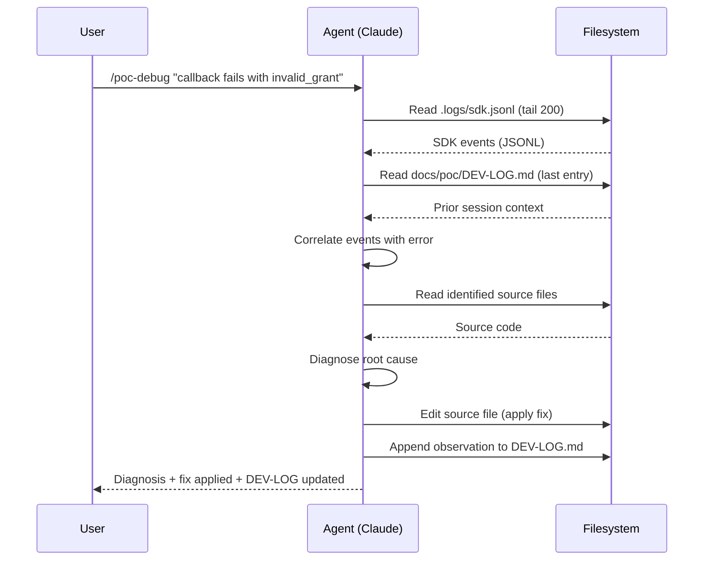
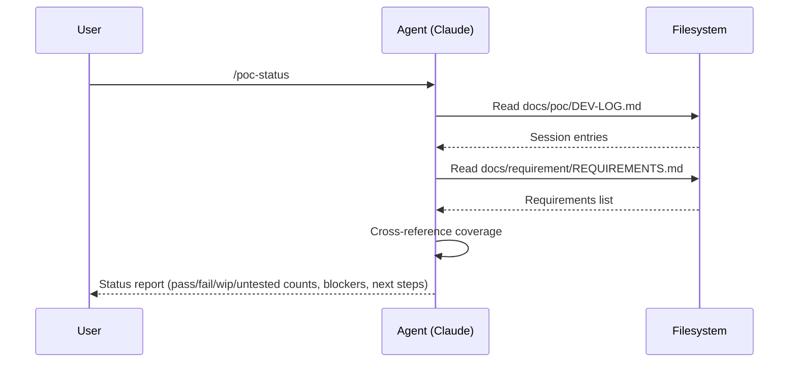
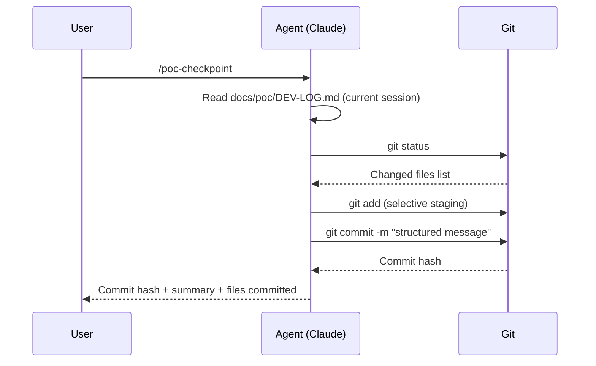

# Design: POC Development Skills

## Overview

Three Claude Code skills for iterative POC development workflows: `/poc-debug` (combined debug + observation recording), `/poc-status` (current state summary), and `/poc-checkpoint` (git commit with session context). These skills fill the gap between ad-hoc exploratory coding and Forge's production workflow by providing structured context persistence, automated log correlation, and session journaling.

## Requirements Reference

- Requirements Doc: `docs/misc/MCD-WORKFLOW-ANALYSIS.md` (Section 5.3)
- FR-1: Debug intake with SDK log auto-read and root cause analysis
- FR-2: Observation recording with requirement coverage tracking
- FR-3: POC state summary with blockers and next steps
- FR-4: Git checkpoint with structured commit messages from session context
- NFR-1: Skills must follow existing forge skill conventions (frontmatter, SKILL.md, directory structure)
- NFR-2: Skills must be workspace-agnostic (paths derived from project root, not hardcoded)
- NFR-3: Skills must degrade gracefully when optional data sources are missing (e.g., no sdk.jsonl yet)

## Solution Overview

```
~/.claude/skills/
├── poc-debug/SKILL.md         ← Debug + observe (unified)
├── poc-status/SKILL.md        ← State summary
└── poc-checkpoint/SKILL.md    ← Git commit with context

Workspace (any POC project):
├── docs/poc/DEV-LOG.md        ← Append-only session journal
├── docs/requirement/REQUIREMENTS.md  ← Requirement coverage source
├── .logs/sdk.jsonl            ← SDK instrumentation output (gitignored)
└── [source files]
```

Each skill is a standalone SKILL.md with no supporting files. Skills instruct the agent to read/write specific workspace files. No templates needed — the DEV-LOG format is defined inline in the skill instructions.

## Public Contract Changes

### Types & Interfaces

Skills are markdown instruction files, not code. The "public contract" is the skill's trigger conditions and expected behavior.

```
Skill: poc-debug
  Trigger: User pastes error, logs, describes failure, or reports observation
  Input: User message (error text, screenshot description, observation)
  Reads: .logs/sdk.jsonl, docs/poc/DEV-LOG.md, relevant source files
  Writes: docs/poc/DEV-LOG.md (append observation entry)
  Output: Diagnosis + fix (for errors) or acknowledgment + insight (for observations)

Skill: poc-status
  Trigger: User asks "where are we", "status", "what works", or starts new session
  Input: None (implicit)
  Reads: docs/poc/DEV-LOG.md, docs/requirement/REQUIREMENTS.md
  Writes: Nothing
  Output: Structured status report

Skill: poc-checkpoint
  Trigger: User says "checkpoint", "commit", "save progress"
  Input: Optional commit message override
  Reads: docs/poc/DEV-LOG.md
  Writes: Git commit (stages relevant files, creates commit)
  Output: Commit hash + summary
```

### DEV-LOG Entry Format

The canonical format for a DEV-LOG.md entry (enforced by poc-debug):

```markdown
---
## Session: {ISO-8601 timestamp}
### Objective
{What was attempted this session}

### Changes
- {file}: {what changed and why}

### Observations
- {Observation with specific data points}

### Status
| Requirement | Status | Notes |
|-------------|--------|-------|
| {req} | {pass/fail/wip/untested} | {detail} |

### Blockers / Open Questions
- {Blocker or question}

### Next Steps
- {What to try next}
---
```

### poc-checkpoint Commit Message Format

```
poc: {summary of session work}

Session: {ISO-8601 timestamp}
Objective: {from DEV-LOG}

Proven:
- {requirements that now pass}

Remaining:
- {requirements still wip/untested}

Blockers:
- {active blockers if any}
```

## Internal Implementation

### Component: poc-debug

**Responsibility:** Unified debug intake + observation recording. Reduces the debug loop from ~5 manual steps to 1 skill invocation.

**Approach:**

1. Determine input type: error/failure vs. neutral observation
   - Heuristic: presence of stack traces, error codes, "error", "fail", "crash", "500", "TypeError" → error mode
   - Screenshot input: if user provides screenshot, describe what's visible, extract error text, then proceed as error or observation mode
   - Otherwise → observation mode

2. Error mode:
   - Read `.logs/sdk.jsonl` — last 200 lines. If user provides timestamp, filter to events within 60s of that timestamp.
   - Read `docs/poc/DEV-LOG.md` — find last session entry by locating the last `## Session:` heading, read from there to end of file (prior context avoids re-investigating known issues)
   - Identify relevant source files from error stack trace or event names
   - Read those source files
   - Correlate SDK events with reported error (match event names, timestamps, error fields)
   - Produce: root cause hypothesis, suggested fix with specific file+line references
   - Apply the fix (edit files)
   - Append structured observation to DEV-LOG.md with diagnosis

3. Observation mode:
   - Append structured observation to DEV-LOG.md
   - Update the requirement coverage Status table (carry forward previous statuses, update changed ones)
   - If observation reveals a new insight or contradicts a prior assumption, flag it explicitly and suggest next action

4. Graceful degradation:
   - No `.logs/sdk.jsonl` → skip log reading, note "SDK logs not available" in output
   - No `docs/poc/DEV-LOG.md` → create it with first entry
   - No `docs/requirement/REQUIREMENTS.md` → skip requirement coverage table

**Key Decisions:**
- Unified debug+observe rather than separate skills: observations often contain errors, and the boundary is artificial. One skill reduces cognitive load.
- 200-line default for sdk.jsonl: covers ~2-3 full OIDC flows. Enough context without overwhelming.
- 60s time window (not 30s): OIDC flows involving redirects can span 30-60s in manual testing.

### Component: poc-status

**Responsibility:** Single-command project state summary. Answers "where are we?" without the agent having to re-read everything.

**Approach:**

1. Read `docs/poc/DEV-LOG.md` — find last `## Session:` heading, extract the Status table from that entry
2. Read `docs/requirement/REQUIREMENTS.md` — extract all requirements (FR-* identifiers or table rows)
3. Cross-reference: identify requirements not covered in the status table
4. Compute summary and output in this format:

```
POC STATUS :: {project name}
━━━━━━━━━━━━━━━━━━━━━━━━━━━━
Last session: {timestamp}
Objective: {last session objective}

COVERAGE: {passed}/{total} requirements proven
  Pass:     {count} — {list}
  WIP:      {count} — {list}
  Failed:   {count} — {list}
  Untested: {count} — {list}

BLOCKERS:
  - {blocker 1}
  - {blocker 2}

NEXT STEPS:
  - {step 1}
  - {step 2}
━━━━━━━━━━━━━━━━━━━━━━━━━━━━
```

**Graceful degradation:**
- No DEV-LOG.md → output "No POC sessions recorded yet. Start with /poc-debug to record your first observation."
- No REQUIREMENTS.md → show DEV-LOG status table only, note requirements doc not found

### Component: poc-checkpoint

**Responsibility:** Create a meaningful git commit that captures session context, not just a code diff.

**Approach:**

1. Read `docs/poc/DEV-LOG.md` — extract current session's Objective, Status, Blockers
2. Run `git status` to identify changed files
3. Stage files intelligently:
   - Always stage: `docs/poc/DEV-LOG.md` (if changed)
   - Always stage: source code changes in `poc/` and SDK source directories
   - Never stage: `.logs/`, `.env*`, `node_modules/`
   - Ask user before staging: files outside expected directories
4. Compose commit message from DEV-LOG session data using the format defined above
5. Create the commit
6. Output: commit hash, files committed, summary

**Graceful degradation:**
- No DEV-LOG.md → use generic commit message, warn user
- No changes to commit → inform user, do not create empty commit

## Wire Format Changes

Not applicable — these are Claude Code skills (markdown instruction files), not network APIs.

## Sequence Diagrams

### poc-debug Error Flow



### poc-status Flow



### poc-checkpoint Flow



## Test Matrix

### Validation Criteria (Skills are markdown, not code — validation is behavioral)

| ID | Skill | Scenario | Input | Expected Behavior | Priority |
|----|-------|----------|-------|-------------------|----------|
| V-1 | poc-debug | Error with SDK logs present | Error text + populated sdk.jsonl | Reads logs, correlates, diagnoses, edits file, appends DEV-LOG | P0 |
| V-2 | poc-debug | Error without SDK logs | Error text, no .logs/ dir | Diagnoses from error text alone, notes "SDK logs not available" | P0 |
| V-3 | poc-debug | Observation (success) | "Login flow works for brand1.com" | Appends observation, updates status table to pass | P0 |
| V-4 | poc-debug | First invocation (no DEV-LOG) | Any input | Creates DEV-LOG.md with first entry | P0 |
| V-5 | poc-debug | Error with timestamp | "Error at 22:30:01" + large sdk.jsonl | Filters to 60s window around timestamp | P1 |
| V-6 | poc-status | Normal state | DEV-LOG + REQUIREMENTS exist | Shows coverage counts, blockers, next steps | P0 |
| V-7 | poc-status | No DEV-LOG | Missing DEV-LOG.md | Helpful message directing to /poc-debug | P0 |
| V-8 | poc-status | No REQUIREMENTS | DEV-LOG exists, no REQUIREMENTS.md | Shows DEV-LOG status only, notes missing file | P1 |
| V-9 | poc-checkpoint | Normal commit | Changed files + DEV-LOG with session | Stages selectively, structured commit message | P0 |
| V-10 | poc-checkpoint | No changes | Clean working tree | Informs user, no empty commit | P0 |
| V-11 | poc-checkpoint | No DEV-LOG | Changed files, no DEV-LOG | Generic commit message, warns user | P1 |

### Edge Cases

| ID | Scenario | Expected Behavior |
|----|----------|-------------------|
| EC-1 | sdk.jsonl is very large (10k+ lines) | Read only last 200 lines, or time-filtered subset |
| EC-2 | DEV-LOG.md has no Status table in last entry | Create fresh status table from scratch |
| EC-3 | User input is ambiguous (could be error or observation) | Default to observation mode, ask user if unsure |
| EC-4 | Multiple sessions in same day | Each gets unique ISO-8601 timestamp |
| EC-5 | DEV-LOG.md has corrupted markdown | Best-effort parsing, do not crash, append new entry cleanly |
| EC-6 | Unstaged files outside poc/ and next/src/ | Ask user before staging |

## Design Decisions

### DD-1: Unified poc-debug vs. Separate poc-debug + poc-observe

**Context:** The workflow analysis identifies debug and observation as conceptually separate. In practice, observations often contain errors and the boundary is fuzzy.

**Options Considered:**
1. Two separate skills (poc-debug + poc-observe) — cleaner separation, but adds cognitive load ("which skill do I use?")
2. One unified skill (poc-debug) — handles both modes via heuristic detection

**Decision:** Option 2 — unified skill

**Rationale:** The user should never have to think about whether they're "debugging" or "observing." The skill auto-detects based on input content. One trigger to remember, one mental model. The workflow analysis itself recommends this unification.

### DD-2: DEV-LOG Format — Markdown vs. JSONL

**Context:** The dev-log needs to be both human-readable (for quick scanning) and machine-parseable (for the agent to extract status tables).

**Options Considered:**
1. JSONL — easy to parse, hard to read
2. Structured markdown — human-readable, parseable via heading conventions

**Decision:** Option 2 — structured markdown

**Rationale:** The DEV-LOG is a developer artifact. It will be read in PRs, by teammates, and during retrospectives. Markdown is the natural format. The agent can parse it via heading-level conventions (## Session, ### Status, etc.).

### DD-3: Skill File Structure — SKILL.md Only vs. SKILL.md + Templates

**Context:** Existing forge skills sometimes include templates (DESIGN-template.md, REQUIREMENTS-template.md).

**Options Considered:**
1. SKILL.md + separate DEV-LOG-template.md — modular, but adds a file
2. SKILL.md only with inline format definition — simpler, self-contained

**Decision:** Option 2 — inline format definition

**Rationale:** The DEV-LOG entry format is short (15 lines). Embedding it in the SKILL.md keeps each skill fully self-contained. Unlike forge's DESIGN-template.md (200 lines), this template doesn't warrant a separate file.

### DD-4: Skill Naming — poc-* vs. forge-poc-*

**Context:** Existing forge skills use `forge-` prefix. These POC skills serve a different workflow phase (pre-forge).

**Options Considered:**
1. `forge-poc-debug` — consistent prefix, but implies these are part of the forge production workflow
2. `poc-debug` — distinct prefix, signals these are for POC/exploratory phase

**Decision:** Option 2 — `poc-*` prefix

**Rationale:** These skills are conceptually pre-forge. Using a different prefix makes the workflow boundary clear: `poc-*` skills for exploratory work, `forge-*` skills for production implementation. The forge orchestrator (`/forge`) lists only `forge-*` skills.

### DD-5: sdk.jsonl Read Strategy — Fixed Lines vs. Time-Filtered

**Context:** sdk.jsonl can grow large over multiple test runs. The agent needs relevant events, not all events.

**Options Considered:**
1. Always read last N lines (simple, but may miss context or include irrelevant events)
2. Time-filtered with fallback to last N lines

**Decision:** Option 2 — time-filtered with fallback

**Rationale:** If the user provides a timestamp (from error output), the agent can filter to a 60s window for precise correlation. If no timestamp, fall back to last 200 lines (covers ~2-3 OIDC flows). This balances precision with simplicity.

## Breaking Changes

None. These are new skills added to the forge repo. No existing skills are modified.

## Documentation Changes

- [x] README.md: Add POC skills to the skills reference table
- [x] README.md: Add "POC Workflow Skills" section explaining the pre-forge phase

## Security Considerations

- poc-debug reads `.logs/sdk.jsonl` which may contain domain names and endpoints — these are non-PII (SDK filters PII before emission per the instrumentation design)
- poc-checkpoint stages files selectively — explicitly excludes `.env*` files to prevent credential commits
- DEV-LOG.md should not contain PII — the skill instructions explicitly direct the agent to use safe data only

## Performance Considerations

- sdk.jsonl tail-read (200 lines) is fast regardless of file size
- DEV-LOG.md will grow over time — the skill reads only the last entry for context, not the entire file
- poc-status reads two files (DEV-LOG + REQUIREMENTS) — negligible

---

**Created:** 2026-02-18
**Last Updated:** 2026-02-18
**Status:** Draft
**Reviewers:** tushar.pandey
