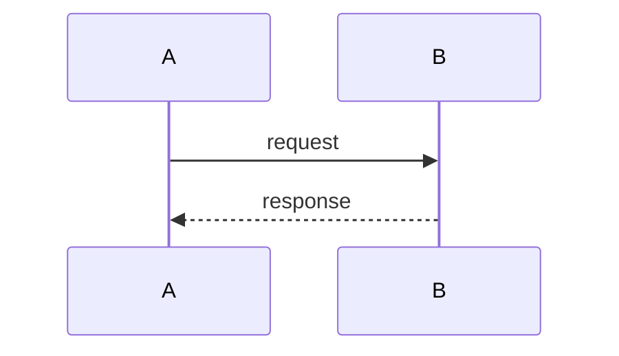

# [Feature Name]: Technical Design

[One-paragraph plain-language summary of the capability and what this document covers. Lightly reader-friendly; no marketing.]

## Section Index

| Section | Title | Contents |
|---------|-------|----------|
| 1 | Architecture | [one line] |
| 2 | [...] | [one line] |
| ... | ... | ... |

---

## 1. Architecture

[Short description: max 2 lines.]

| [Dimension] | [Col] | [Col] |
|-------------|-------|-------|
| ... | ... | ... |

### 1.1 [Subsection]

[Short description: max 2 lines.]

[Code changes if any, then detail: tables / lists / prose.]

---

## 2. [Major Section]

[Short description: max 2 lines.]

[Section-contents table enumerating subsections. Each row carries an ID; no separate "Section" column. The ID is embedded in the heading as {section}.{ID}.]

| ID | Subject |
|----|---------|
| X1 | ... |

### 2.X1 [Subsection]

[Heading (with embedded ID), then short description (max 2 lines), then code changes (real target-language code), then detail.]

```typescript
// real code, not pseudocode
```

| [enumeration table for the subsection's contents] | | |
|---|---|---|

<!--
AUTHORING RULES (do not emit this comment into the final doc):
- Stakeholder-facing: SEs, PMs, EMs. Focus on approach and what changes, not code volume.
- Confident language only. No ambiguity/indecision words (maybe, possibly, TBD, might).
- No internal scaffolding: no .forge paths, state.json, artifact filenames, ticket IDs,
  internal initiative/tool/person/codenames, no (LOCKED)/(deferred)/(approved),
  no inline requirement/decision tags (FR-/NFR-/OQ-/DD-) in prose.
- Every major section opens with a contents table; every subsection is numbered.
- Subsection order: heading -> short description (<=2 lines) -> code changes -> detail.
- Real target-language code (TypeScript here), not pseudocode.
- All diagrams in mermaid, clean and uncluttered. No ASCII art.
- Test matrix: tables only (case ID, scenario, expectation). No test code.
- Section named "Implementation" (not "Internal Approach").
- Design Decisions ordered by impact, summary table first; optional context subsections.
- Replace every em dash with a colon. Remove AI-smell phrasing.
- No self-validation checklist. No document footer / sign-off trailer.
-->

## [Public Contracts] (example major section)

[Short description.]

| ID | Subject | Package |
|----|---------|---------|
| C1 | [type/method/error] | [pkg] |

### 3.C1 [Contract]

[Description, then real code, then a table summarizing fields/methods/behavior.]

## [Network Contracts] (example)

| ID | Endpoint | Used by |
|----|----------|---------|

### 4.W1 [Endpoint]

[Description, request/response blocks, outcome table.]

## Implementation

[Short description. NOT "Internal Approach".]

| ID | Component | File |
|----|-----------|------|

### 5.I1 [Component]

[Description, real code changes, then a table of behavior/decisions.]

## Sequence Diagrams

[Use mermaid; one diagram per interaction; keep them uncluttered. Diagrams may also live inline within the relevant subsection.]



## Test Matrix

[Tables only. No code.]

| ID | Component |
|----|-----------|
| T1 | ... |

### 6.T1 [Group]

| Case | Scenario | Expectation |
|------|----------|-------------|
| T1.1 | ... | ... |

## Design Decisions

[Ordered by impact, highest first.]

| ID | Decision | Impact |
|----|----------|--------|
| D1 | ... | High |

### 7.D1 [Decision]

[Short description, then rationale and chosen approach. Optional; the table alone may suffice for low-impact decisions.]

## Security

| ID | Topic |
|----|-------|

### 8.S1 [Topic]

[Description and detail.]

## Compatibility

[Additive surface, breaking changes if any, forward-compatibility notes. Table of additions.]

| Addition | Package |
|----------|---------|
