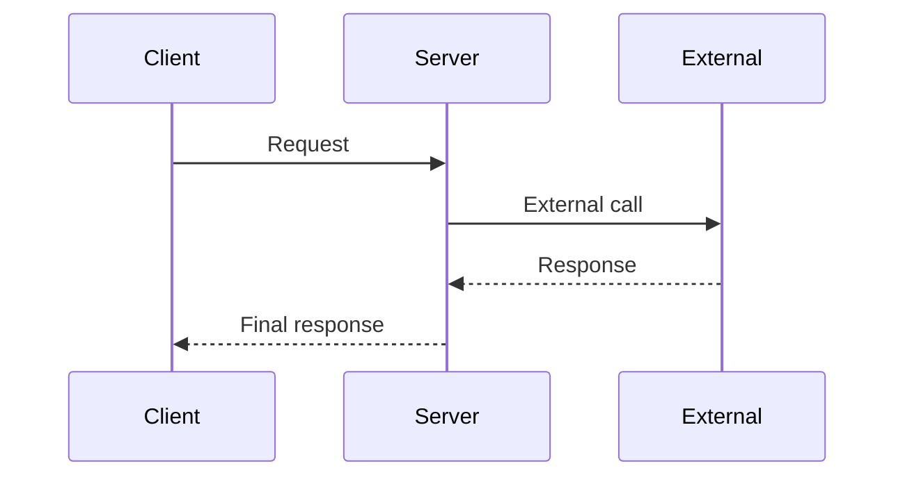
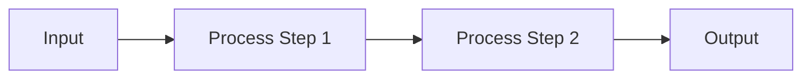

# Design: [FEATURE NAME]

## Overview

Brief description of the solution approach.

## Requirements Reference

- Requirements Doc: `docs/requirement/REQUIREMENTS.md`
- Key FRs addressed: FR-1, FR-2, ...
- Key NFRs addressed: NFR-1, NFR-2, ...

## Solution Overview

High-level description of the solution architecture.

```
[ASCII diagram or description of component interactions]
```

## Public Contract Changes

### Types & Interfaces

```typescript
// New or modified types/interfaces
interface NewType {
  field: Type;
  optionalField?: Type;
}

type UnionType = TypeA | TypeB;
```

### Methods & Functions

| Method | Signature | Description | Errors Thrown |
|--------|-----------|-------------|---------------|
| methodName | `(param: Type) => ReturnType` | What it does | ErrorType conditions |

### Errors

| Error | Code | Condition | Recovery Strategy |
|-------|------|-----------|-------------------|
| ErrorName | ERROR_CODE | When this error is thrown | How caller should handle |

### Constants & Configuration

| Name | Type | Default | Description |
|------|------|---------|-------------|
| CONFIG_KEY | string | "value" | Purpose of this config |

## Internal Implementation

### Component: [Component Name]

**Responsibility:** What this component does

**Approach:**
1. Step 1 description
2. Step 2 description
3. Step 3 description

**Key Decisions:**
- Decision and rationale

### Component: [Component Name 2]

...

## Wire Format Changes

### API: [Endpoint or Method Name]

**Direction:** Client → Server / Server → External Service

**Request:**
```json
{
  "field": "type - description",
  "nested": {
    "innerField": "type - description"
  }
}
```

**Response (Success):**
```json
{
  "field": "type - description",
  "data": {}
}
```

**Response (Error):**
```json
{
  "error": "error_code",
  "message": "Human readable message",
  "details": {}
}
```

## Sequence Diagrams



## Data Flow Diagram



## Test Matrix

### Unit Tests

| ID | Component | Test Case | Input | Expected Output | Priority |
|----|-----------|-----------|-------|-----------------|----------|
| UT-1 | [component] | Happy path description | [input] | [expected] | P0 |
| UT-2 | [component] | Error case description | [input] | [error] | P0 |

### Integration / Flow Tests

| ID | Flow | Steps | Test Dependencies | Assertions | Priority |
|----|------|-------|-------------------|------------|----------|
| FT-1 | [flow name] | 1. action 2. action | [mocks/stubs per codebase conventions] | [assertions] | P0 |

### Edge Cases

| ID | Scenario | Expected Behavior |
|----|----------|-------------------|
| EC-1 | [edge case] | [expected behavior] |

## Design Decisions

### DD-1: [Decision Title]

**Context:** Situation that required a decision

**Options Considered:**
1. Option A - pros and cons
2. Option B - pros and cons

**Decision:** Chosen option

**Rationale:** Why this option was selected

## Breaking Changes

| Change | Impact | Migration Path |
|--------|--------|----------------|
| [what changed] | [who/what affected] | [how to migrate] |

## Documentation Changes

- [ ] README.md: [what needs updating]
- [ ] API docs: [what needs updating]
- [ ] EXAMPLES.md: [what examples to add]

## Security Considerations

- [Security aspect 1]
- [Security aspect 2]

## Performance Considerations

- [Performance aspect 1]
- [Performance aspect 2]

## Appendix

### External References

| Name | URL | Relevance |
|------|-----|-----------|
| [name] | [url] | [why relevant] |

### Related Code

| File | Relevance |
|------|-----------|
| [path/to/file] | [why this file is relevant] |

---

**Created:** [DATE]
**Last Updated:** [DATE]
**Status:** Draft / In Review / Approved
**Reviewers:** [names]
