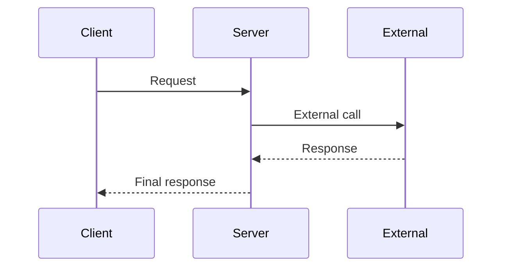

# Design: [FEATURE NAME]

## Overview

Brief description of the solution approach.

## Requirements Reference

- Requirements: `[path]/REQUIREMENTS.md`
- Key FRs: FR-1, FR-2, ...
- Key NFRs: NFR-1, NFR-2, ...

## Solution Overview

High-level description of the solution architecture.

```
[ASCII diagram or description of component interactions]
```

## Public Contract Changes

### Types & Interfaces

```
// Pseudocode — adapt to project language
TYPE NewType:
  field: Type
  optionalField?: Type

TYPE UnionType = TypeA | TypeB
```

### Methods & Functions

- `methodName(param: Type) -> ReturnType`
  - Description: [what it does]
  - Errors: [ErrorType when condition]

- `anotherMethod(param: Type) -> ReturnType`
  - Description: [what it does]
  - Errors: [ErrorType when condition]

### Errors

- ErrorName (ERROR_CODE): [when thrown] — recovery: [how caller handles]
- ErrorName (ERROR_CODE): [when thrown] — recovery: [how caller handles]

### Constants & Configuration

- CONFIG_KEY (Type, default: "value"): [purpose]
- CONFIG_KEY (Type, default: "value"): [purpose]

## Internal Implementation

### Component: [Name]

**Responsibility:** [what this component does]

**Approach:**
1. Step 1 description
2. Step 2 description
3. Step 3 description

**Key Decisions:**
- [decision and rationale]

### Component: [Name 2]

...

## Wire Format Changes

### [Endpoint or Method Name]

**Direction:** Client -> Server / Server -> External

**Request:**
```
{
  "field": "type — description",
  "nested": {
    "innerField": "type — description"
  }
}
```

**Response (Success):**
```
{
  "field": "type — description",
  "data": {}
}
```

**Response (Error):**
```
{
  "error": "error_code",
  "message": "Human readable message"
}
```

## Sequence Diagrams



## Test Matrix

### Unit Tests

- UT-1 ([component]): Happy path — [input] -> [expected] (P0)
- UT-2 ([component]): Error case — [input] -> [error] (P0)
- UT-3 ([component]): Edge case — [input] -> [expected] (P1)

### Flow Tests

- FT-1 ([flow]): [steps] — asserts: [assertions] (P0)
- FT-2 ([flow]): [steps] — asserts: [assertions] (P0)

### Edge Cases

- EC-1: [scenario] — expected: [behavior]
- EC-2: [scenario] — expected: [behavior]

## Design Decisions

### DD-1: [Decision Title]

**Context:** [situation requiring a decision]

**Options:**
1. [Option A] — pros: [list], cons: [list]
2. [Option B] — pros: [list], cons: [list]

**Decision:** [chosen option]

**Rationale:** [why]

**Research:** [path to design-artifact file, if applicable]

## Breaking Changes

- [change]: impact on [who/what] — migration: [how to migrate]

## Security Considerations

- [aspect 1]
- [aspect 2]

## Performance Considerations

- [aspect 1]
- [aspect 2]

## Appendix

### Related Code

- [path]: [relevance]
- [path]: [relevance]

---

**Created:** [DATE]
**Last Updated:** [DATE]
**Status:** Draft / In Review / Approved
